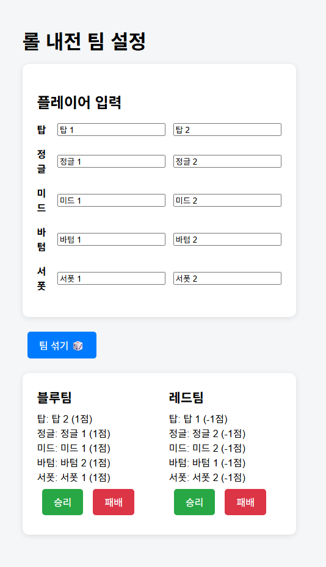

# 🎮 롤 내전 팀 섞기 - lolrand

포지션별로 입력한 10명의 플레이어를 랜덤으로 **블루팀**과 **레드팀**으로 나눠주는 React 기반 웹앱입니다.  
간단한 UI로 팀을 섞고, 팀별 승/패 버튼을 눌러 각 플레이어의 승점을 기록할 수 있어요!

👉 [배포된 앱 바로가기](https://HeoJamong.github.io/lolrand)

---

## ✨ 주요 기능

- 포지션: 탑, 정글, 미드, 바텀, 서폿
- 10명의 이름을 포지션별로 입력
- 버튼 클릭 시 팀 자동 섞기 (블루팀 / 레드팀)
- 팀별 **승리 / 패배 버튼** 클릭 시, 해당 팀원 전체 승점 +1 / -1
- 각 플레이어 이름 옆에 현재 승점 표시

---

## 🖼️ 스크린샷




---

## 🛠 사용 기술

* React 19
* React Hooks (useState)
* CSS를 활용한 간단한 커스텀 스타일링
* GitHub Pages 배포

---

## 📦 프로젝트 실행 방법 (로컬 개발)

```bash
git clone https://github.com/HeoJamong/lolrand.git
cd lolrand
npm install
npm start
```

---

## 🚀 GitHub Pages 배포 방법

```bash
npm run deploy
```

> `gh-pages` 브랜치에 자동으로 업로드되며, [https://HeoJamong.github.io/lolrand](https://HeoJamong.github.io/lolrand) 에 반영됩니다.

---

## 🙋 개발자

* GitHub: [@HeoJamong](https://github.com/HeoJamong)


---

## ✅ 활용 팁

- 이 파일을 루트에 `README.md`로 저장
- 커밋 & 푸시:

```bash
git add README.md
git commit -m "docs: add project README"
git push
````

